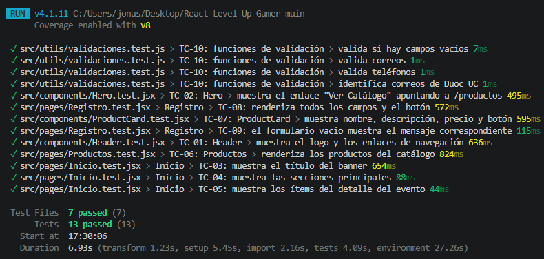
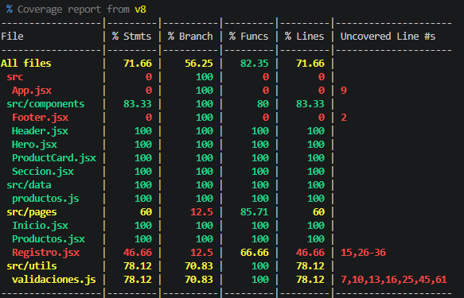

# Informe de Pruebas Unitarias: Level-Up Gamer
Verificar que los componentes, páginas y funciones de validación del sitio migrado a React funcionan correctamente y mantienen el comportamiento esperado.

## Alcance

**Incluido:** Header, Hero, ProductCard, páginas Inicio, Productos y Registro, y funciones de validación (`validaciones.js`).

**No incluido:** `App.jsx` (enrutamiento), `Footer.jsx`, pruebas de extremo a extremo, rendimiento y compatibilidad entre navegadores.

##  Herramientas y entorno

| Herramienta | Uso |
|-------------|-----|
| Vitest 4.1.11 | Framework de pruebas, integrado con Vite |
| jsdom | Simula el navegador dentro de Node.js |
| React Testing Library | Renderiza componentes y los consulta como lo haría un usuario |
| jest-dom | Aserciones sobre el DOM (`toBeInTheDocument`, etc.) |
| @vitest/coverage-v8 | Medición de cobertura de código |

**Entorno:** Windows, Node v25.9.0, VS Code.

**Instalación:**

```bash
npm install -D vitest jsdom @testing-library/react @testing-library/jest-dom @vitest/coverage-v8
```

**Ejecución de las pruebas:**

```bash
npx vitest run --coverage --reporter=verbose
```

##  Archivos creados y modificados

Para implementar las pruebas se configuró el entorno y se crearon 7 archivos de prueba, sin modificar el código de la aplicación.

**Configuración:**

| Archivo | Cambio |
|---------|--------|
| `vite.config.js` | Se agregó el bloque `test` (entorno `jsdom`, `globals: true` y `setupFiles`) |
| `src/setupTests.js` | Archivo nuevo: importa `@testing-library/jest-dom` |
| `package.json` | Se agregó el script `"test": "vitest"` y las dependencias de desarrollo |

**Archivos de prueba creados:**

| Archivo | Qué prueba | Casos |
|---------|-----------|-------|
| `src/components/Header.test.jsx` | Logo y enlaces de navegación | TC-01 |
| `src/components/Hero.test.jsx` | Enlace "Ver Catálogo" hacia `/productos` | TC-02 |
| `src/components/ProductCard.test.jsx` | Contenido de la tarjeta de producto | TC-07 |
| `src/pages/Inicio.test.jsx` | Banner, secciones y detalle del evento | TC-03, TC-04, TC-05 |
| `src/pages/Productos.test.jsx` | Catálogo de productos | TC-06 |
| `src/pages/Registro.test.jsx` | Campos del formulario y validación de formulario vacío | TC-08, TC-09 |
| `src/utils/validaciones.test.js` | Funciones de validación | TC-10 (4 pruebas) |

Total: 7 archivos de prueba, 13 pruebas.

##  Casos de prueba

| ID | Módulo | Descripción | Resultado esperado | Estado |
|----|--------|-------------|--------------------|--------|
| TC-01 | Header | Muestra el logo y los enlaces de navegación | Logo, Inicio, Productos, Regístrate y Eventos visibles | ✅ Pasó |
| TC-02 | Hero | Enlace "Ver Catálogo" | El enlace apunta a `/productos` | ✅ Pasó |
| TC-03 | Inicio | Título del banner | Se muestra el título principal | ✅ Pasó |
| TC-04 | Inicio | Secciones principales | Se muestran las secciones de contenido | ✅ Pasó |
| TC-05 | Inicio | Ítems del detalle del evento | Se muestran los datos del evento | ✅ Pasó |
| TC-06 | Productos | Catálogo | Se renderizan los productos de la lista | ✅ Pasó |
| TC-07 | ProductCard | Contenido de la tarjeta | Nombre, descripción, precio y botón "Agregar al Carrito" visibles | ✅ Pasó |
| TC-08 | Registro | Campos del formulario | Todos los campos y el botón de registro presentes | ✅ Pasó |
| TC-09 | Registro | Formulario vacío | Aparece el mensaje "Debe rellenar todas las casillas" | ✅ Pasó |
| TC-10a | Validaciones | Campos vacíos (`hayCamposVacios`) | Detecta datos incompletos | ✅ Pasó |
| TC-10b | Validaciones | Correos (`correoValido`) | Acepta válidos y rechaza inválidos | ✅ Pasó |
| TC-10c | Validaciones | Teléfonos (`telefonoValido`) | Acepta válidos y rechaza inválidos | ✅ Pasó |
| TC-10d | Validaciones | Correos DuocUC (`esCorreoDuoc`) | Identifica correctamente el dominio | ✅ Pasó |

> TC-10 agrupa cuatro pruebas de las funciones de validación.

##  Resumen de resultados

| Indicador | Valor |
|-----------|-------|
| Archivos de prueba | 7 ejecutados, 7 exitosos |
| Pruebas | 13 ejecutadas, 13 exitosas, 0 fallidas |
| Duración total | 6.93 s |
| Defectos encontrados | Ninguno |

##  Cobertura de código

| Métrica | Resultado |
|---------|-----------|
| Sentencias | 71.66 % |
| Ramas | 56.25 % |
| Funciones | 82.35 % |
| Líneas | 71.66 % |

| Archivo | Sentencias | Ramas | Funciones |
|---------|-----------|-------|-----------|
| Header, Hero, ProductCard, Seccion | 100 % | 100 % | 100 % |
| Inicio, Productos | 100 % | 100 % | 100 % |
| productos.js (datos) | 100 % | 100 % | 100 % |
| validaciones.js | 78.12 % | 70.83 % | 100 % |
| Registro.jsx | 46.66 % | 12.5 % | 66.66 % |
| Footer.jsx | 0 % | 100 % | 0 % |
| App.jsx | 0 % | 100 % | 0 % |

##  Análisis

- Los componentes de presentación (Header, Hero, ProductCard, Inicio y Productos) quedaron **completamente cubiertos**.
- **Registro.jsx (46.66 %)** es el módulo con mayor oportunidad de mejora: solo se probó el renderizado y el envío con el formulario vacío.
- **validaciones.js (78.12 %)** tiene ramas sin ejecutar, correspondientes a casos límite.
- **App.jsx y Footer.jsx** no cuentan con pruebas, por lo que figuran con 0 %.

##  Conclusiones y recomendaciones

Las 13 pruebas ejecutadas fueron exitosas, por lo que los componentes y funciones evaluados se comportan según lo esperado tras la migración a React. La cobertura global es de 71.66 %.


##  Evidencias

**Ejecución de las pruebas (13 en verde):**



**Tabla de cobertura:**

